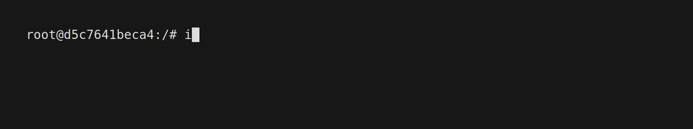
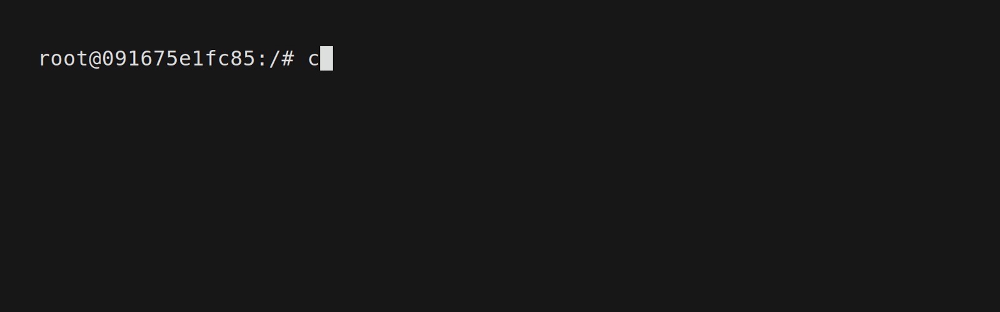

<div align="center">

# 

</div>

<h3 align="center">
  Raido is a "VPN-like" reverse proxy with traffic tunneling via QUIC for accessing private networks.
</h3>

<p align="center">
  <a href="https://fr13n8.github.io/blog/"></a>
  
  
</p>

<div align="center">
  
</div>

In this diagram, the client side starts the service and the Raido proxy server on its side. Then the Agent is started on the server side to connect to our proxy server via the QUIC protocol. The client can then open a tunnel between the server, interact with local resources (access to local ports is provided by reserved addresses 240.0.0.0/4 that are generated for each tunnel when it is opened) and IP addresses of the same network where the server itself is located as if they were in the same network. Also, the Raido proxy server supports multi-connections and manual management of available addresses.

---

> [!WARNING]
> **The functionality was tested only on Linux machines.**\
> **The program may work unstable because there are no tests.**

## Features

- Application
  - No Wireguard, SOCKS, Proxychains
  - Userspace network stack with gVisor
  - Traffic tunneling over QUIC
  - Easy to use
  - Possible to run in daemon mode
  - Automatic management of **TUN** interfaces
  - Self-signed certificates
  - Pause and resume tunnels
  - Loopback routing using network range (240.0.0.0/4)
- Network
  - TCP
  - UDP
  - IPv4
  - IPv6

## Requirements

### Agent side

Bidirectional UDP access to proxy on one port.

### Proxy side

Privileged access to create and configure the **TUN** interface.

## Quick Start

### Start the raido service

```bash
proxy ❯❯ raido --help      # help options
proxy ❯❯ raido service run # for foreground mode
```


Or you can install raido as daemon and start it.

```bash
proxy ❯❯ raido service --help  # servie help options
proxy ❯❯ raido service install # install raido.service
proxy ❯❯ raido service start   # start raido in daemon mode
proxy ❯❯ raido service status  # check raido.service status
```


### Start the raido proxy server

```bash
proxy ❯❯ raido proxy start # start proxy server by default on address 0.0.0.0:8787
```


### Start agent on remote server

```bash
agent ❯❯ agent -pa 10.1.0.2:8787 -ch $(CERT_HASH)
```


### Check all connected agents

```bash
proxy ❯❯ raido agent list # print all agents and their available routes in a table
```


### Start tunneling to agent

```bash
proxy ❯❯ raido tunnel start --agent-id R6QXeSMXTL2attGG8YEsr6 # the command creates the tun interface and adds all routes
proxy ❯❯ raido tunnel list
```


That's it, now you can send requests directly to these addresses.


## Loopback routing: Access the local services of the remote host

> [!NOTE]
> **Each time a new tunnel is started, raido obtains an available IP address in the `240.0.0.0/4` range and adds it to the device's routes to forward requests for that address to the localhost services on the remote host.**\
> **If necessary, you can remove and manually add an address from the `240.0.0.0/4` range**

Lets run simple http server with python cli on server host on port `8080`.



And then from user host we can access this servere via loopback route.



## TODO

- Think about a way to transmit ICMP packets without changing the gVisor code. (Maybe use agent to detect hosts using icmp-echo requests) ¯\\_(ツ)_/¯
- Add new transport protocols for traffic tunneling
- Add the ability to build chains of agents
- Add multiplatform support
- FIX BUGS!
