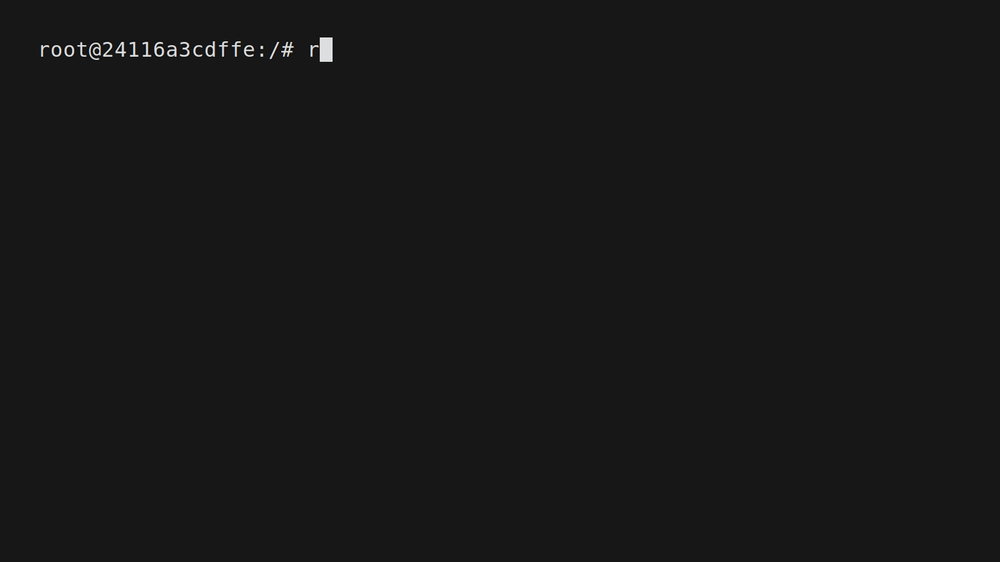
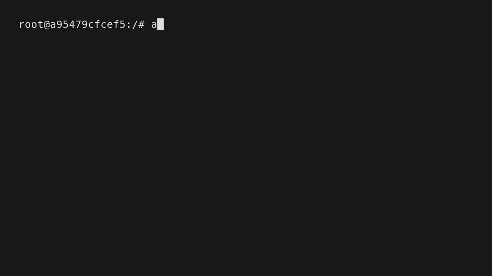
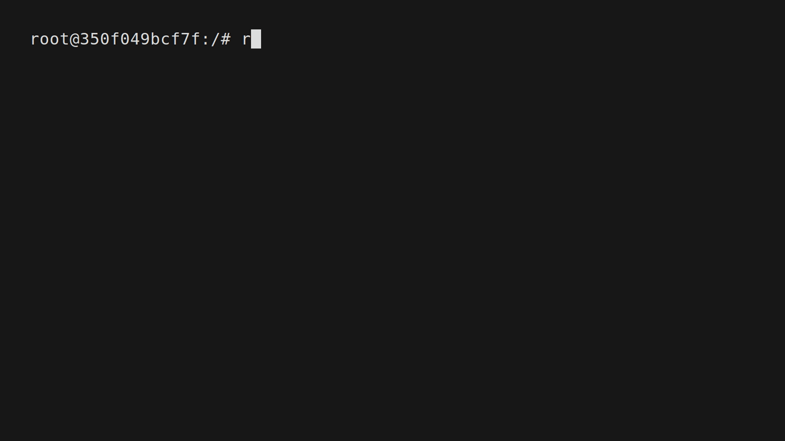
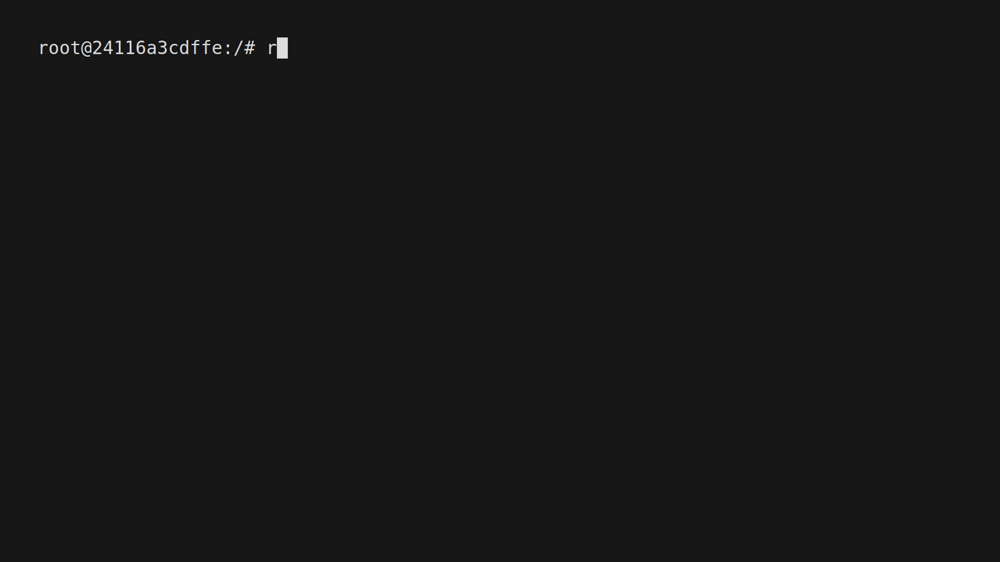

<h1 align="center">
  
</h1>

<h3 align="center">Raido is a "VPN-like" reverse proxy with traffic tunneling via QUIC for accessing private networks</h3>

<p align="center">
  <a href="https://fr13n8.github.io/blog/"></a>
  
  
</p>

<div align="center">
  
</div>

---

> [!WARNING]
> **The functionality was tested only on Linux machines.**\
> **The program may work unstable because there are no tests.**

## Features

- Application
  - No Wireguard, SOCKS, Proxychains
  - Userspace network stack with gVisor
  - Traffic tunneling over QUIC
  - Easy to use
  - Possible to run in daemon mode
  - Automatic management of **TUN** interfaces
  - Self-signed certificates
  - Pause and resume tunnels
- Network
  - TCP
  - UDP

## Requirements

### Agent side

Bidirectional UDP access to proxy on one port.

### Proxy side

Privileged access to create and configure the **TUN** interface.

## Quick Start

### Start the raido service

```bash
proxy ❯❯ raido --help      # help options
proxy ❯❯ raido service run # for foreground mode
```


Or you can install raido as daemon and start it.

```bash
proxy ❯❯ raido service --help  # servie help options
proxy ❯❯ raido service install # install raido.service
proxy ❯❯ raido service start   # start raido in daemon mode
proxy ❯❯ raido service status  # check raido.service status
```


### Start the raido proxy server

```bash
proxy ❯❯ raido proxy start # start proxy server by default on address 0.0.0.0:8787
INF proxy started with cert hash: 6A2ABD1043C9CB943BE1884EBE4947023FD49D894AC1267E087C4D4B24743996
```



### Start agent on remote server

```bash
agent ❯❯ agent -pa 10.1.0.2:8787 -ch 6A2ABD1043C9CB943BE1884EBE4947023FD49D894AC1267E087C4D4B24743996
```



### Check all connected agents

```bash
proxy ❯❯ raido agent list # print all agents and their available routes in a table
┌───┬────────────────────────┬───────────────────┬─────────────┐
│ № │           ID           │     Hostname      │   Routes    │
├───┼────────────────────────┼───────────────────┼─────────────┤
│ 1 │ R6QXeSMXTL2attGG8YEsr6 │ root@99e5d6f726b5 │ 10.2.0.3/16 │
│   │                        │                   │ 10.1.0.3/16 │
└───┴────────────────────────┴───────────────────┴─────────────┘
```



### Start tunneling to agent

```bash
proxy ❯❯ raido tunnel start --agent-id R6QXeSMXTL2attGG8YEsr6 # the command creates the tun interface and adds all routes
proxy ❯❯ raido tunnel list
┌───┬────────────────────────┬───────────────────┬─────────────┐
│ № │           ID           │     Hostname      │   Routes    │
├───┼────────────────────────┼───────────────────┼─────────────┤
│ 1 │ R6QXeSMXTL2attGG8YEsr6 │ root@99e5d6f726b5 │ 10.2.0.3/16 │
│   │                        │                   │ 10.1.0.3/16 │
└───┴────────────────────────┴───────────────────┴─────────────┘
```



That's it, now you can send requests directly to these addresses.


## TODO

- Think about a way to transmit ICMP packets without changing the gVisor code. (Maybe use agent to detect hosts using icmp-echo requests) ¯\\_(ツ)_/¯
- Add new transport protocols for traffic tunneling
- Add the ability to build chains of agents
- Add multiplatform support
- Add logging options
- FIX BUGS!
